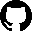

<h1 align="center">Projeto page Super Mario - O Filme</h1>

  This project is a web page that presents a synopsis of the movie Super Mario - The Movie including showing the trailer by clicking on the "Veja o Trailer" button.

  Este projeto é uma página web que apresenta uma sinopse do filme Super Mario - O Filme incluindo a apresentação do trailer clicando no botão "Veja o Trailer".

 

  <a href="#-technologies-tecnologias">Technologies / Tecnologias</a>&nbsp;&nbsp;&nbsp;|&nbsp;&nbsp;&nbsp;
  <a href="#-project-projeto">Project / Projeto</a>&nbsp;&nbsp;&nbsp;|&nbsp;&nbsp;&nbsp;
  <a href="#-layout">Layout</a>&nbsp;&nbsp;&nbsp;|&nbsp;&nbsp;&nbsp;
  <a href="#-license-licença">License /Licença</a>

🖥️ Desktop

  

  

📱Responsiveness/ Responsividade

  

 

## 🚀 Technologies / Tecnologias  

This project was developed with the following technologies:  

Esse projeto foi desenvolvido com as seguintes tecnologias: 

     

  

## 💻 Project / Projeto
 

 Super Mario - The Movie is a project developed during the Week from scratch to the contracted programmer[Dev em dobro](https://instagram.com/devemdobro?igshid=YmMyMTA2M2Y=), where a presentation page was created where it is possible to watch the movie trailer 

Super Mario - O Filme é um projeto desenvolvido durante a Semana do zero ao programador contratado do [Dev em dobro](https://instagram.com/devemdobro?igshid=YmMyMTA2M2Y=),onde foi criado uma página de apresentação onde é possível assistir o trailer do filme
## 🔖 Layout

You can preview the project layout through [FROM THIS LINK](https://jacquenunes.github.io/project-supermario-themovie/) 

Você pode visualizar o layout do projeto através [DESSE LINK](https://jacquenunes.github.io/project-supermario-themovie/)

## License / Licença

This project is licensed under the MIT license.

Esse projeto está sob a licença MIT.

---

Made by / Feito por [Jacqueline Nunes](https://github.com/JacqueNunes). 